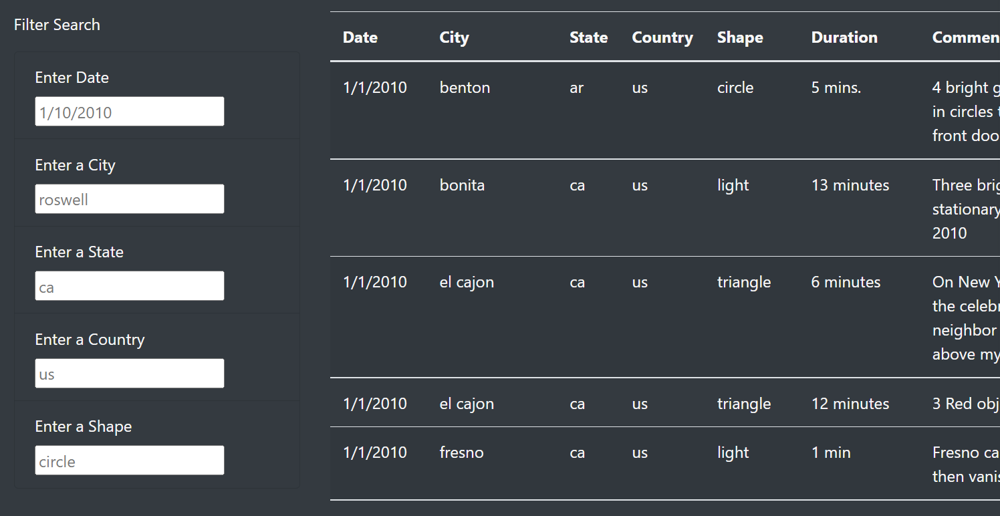
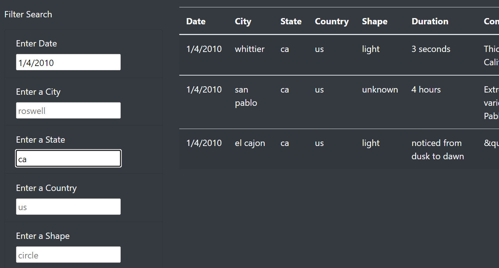
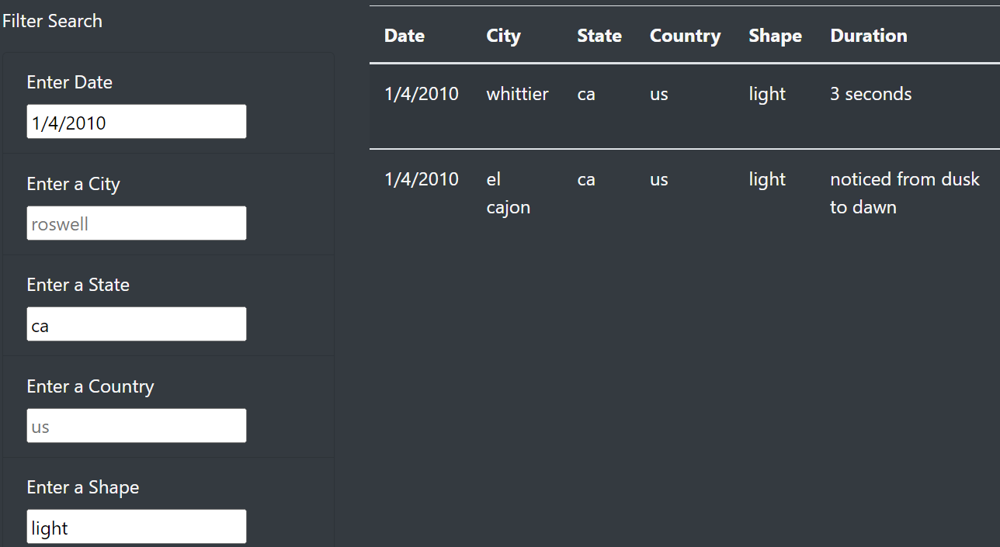
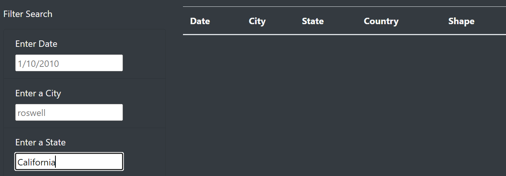

# UFOs

## Overview of Project

After learning to code the html for a website that includes a dynamic table with a user-input filter option, Dana is not seeking to go further and expand the filtering options to the user with multiple user-input elements.  We duplicated the <li> items for most ids in the data object (city, state, country, and shape added to datetime).  We then needed to make our function loop through an object that holds the id and value of each user input given.  We also had to update our d3 listener for the changes to an input field rather than clicking a button like we had. In the end, the user is able to filter the table on multiple columns to find specific UFO sitings (there was one in my hometown in 2010!).

## Results

To perform a search, a user needs only to type information into any of the user-input fields provided, and hit "enter" to signal the change to our d3 listening statement.

### Drilling Down

The two images here show how the user can narrow down their search using multiple paramters like the date, state, and then the shape of the UFO sitings in this case:

### Drilling Even further!

Further filters can be implemented without clearring the former ones as seen here:

## Summary

### Potential Drawback.

The code does require that users entere items exactly as they're found in the table data.  So we provided some sample code (placeholders) to demonstrate.  Below is an example of an empty table returned when a user provides information in a different format:

### Recommendations for Improvement.

1.  To correct for that drawback, some code could be written to collect several popular entry formats that one might expect so that they can be translated into the necessary table value format in the backend and bring out results for the user of the site despite whether they matched correctly when entering their parameters.

2.  It could also help to add other features for the user that sorts the table by a given column.  Further, we could offer some descriptive outputs like the number of rows available in their filtered table.  Then they might have an idea of they should drill down futher to narrow their results or not.

